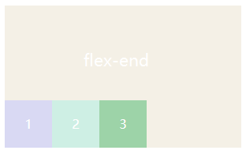
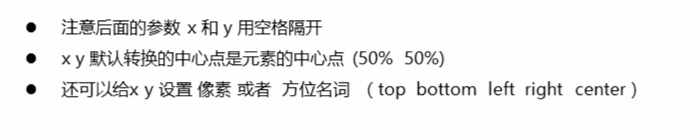
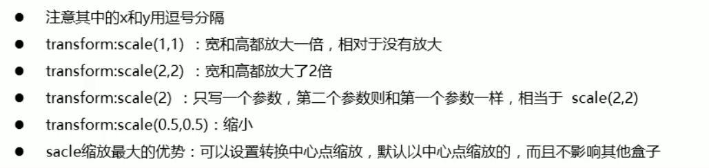

## 内边距、外边距


### 外边距

`margin` 属性为给定元素设置所有四个（上下左右）方向的外边距属性。也就是 `margin-top` ，`margin-right` ，`margin-bottom` ，和 `margin-left `四个外边距属性设置的简写。

```css
/* 应用于所有边 */
margin: 0;
margin: -3px;

/* 上边下边 | 左边右边 */
margin: 0 auto;

/* 上边 | 左边右边 | 下边 */
margin: 1em auto 2em;

/* 上边 | 右边 | 下边 | 左边 */
margin: 2px 1em 0 auto;

/* 全局值 */
margin: inherit;
margin: initial;
margin: unset;
```

取值：绝对值、相对值、auto、继承值。


### 外边距合并


合并的结果为：

两个相邻的外边距都是正数时，折叠结果是它们两者之间较大的值。

两个相邻的外边距都是负数时，折叠结果是两者绝对值的较大值。

两个外边距一正一负时，折叠结果是两者的相加的和。


- 没有内容将父元素和相邻子元素分开

 如果没有边框 `border` ，内边 `padding` ，其它内容或其它子元素来分开一个块级元素的上边界与其内一个或多个后代块级元素的上边界；那么子元素设置的 `margin-top` 就不会生效，而是令它的父元素生效，如果父元素也是这一情况那就会一直向上传递。

下边界也会出现这种情况，左右边界不会。

```html
<div class="father">
      <div class="son1">
            <div class="son2"></div>
      </div>       
</div>
.son2{
    margin-top:30px;
}
//如图， margin-top:30px 一直传递到了.father
```


- 上下相邻兄弟元素之间的重叠，但不会向上传递！

```html
 <div class="father">
        <div class="son1"></div>
        <div class="son2"></div>  
</div>
.son1{
   margin-bottom:10px;
}
.son2{
   margin-top:30px;
}
```

.son1 和 .son2 之间的上下边距为30px，合并为了大的外边距。


### 如何解决外边距合并


父子之间重叠

1. 给父元素设置边框
2. 给父元素设置内边距
3. 将父元素变为BFC，如 `overflow: hidden`
4. 子元素变为BFC，如使子元素浮动、子元素变为行内样式、子元素添加定位

兄弟之间重叠

1. 将其中一个或两个都成为BFC的子元素
2. 底部元素变为BFC，如使子元素浮动、子元素变为行内样式、子元素添加定位


### 内边距


## 定位


position 的常见四个属性值： relative，absolute，fixed，static。

一般都要配合"left"、"top"、"right" 以及 "bottom" 属性使用。 

1. Static：默认位置，设置为 static 的元素，它始终会处于页面流给予的位置（static 元素 会忽略任何 top、bottom、left 或 right 声明）。一般不常用。 
2. Relative：位置被设置为 relative 的元素，可将其移至相对于其正常位置的地方，意思就 是如果设置了 relative 值，那么，它偏移的 top，right，bottom，left 的值都以它原来的位置为基准 偏移，而不管其他元素会怎么样。注意 relative 移动后的元素**在原来的位置仍占据空间。**
3. Absolute：位置设置为 absolute 的元素，可定位于相对于包含它的元素的指定坐标。意 思就是如果它的父容器设置了 position 属性，并且 position 的属性值为 absolute 或者 relative，那么 就会依据父容器进行偏移。如果其父容器没有设置 position 属性，那么偏移是以 body 为依据。注 意设置 absolute 属性的元素**在标准流中不占位置**。 
4. Fixed：位置被设置为 fixed 的元素，可定位于相对于浏览器窗口的指定坐标。不论窗口 滚动与否，元素都会留在那个位置。它始终是以 body 为依据的。注意设置 fixed 属性的元素**在标准流中不占位置**。


## 浮动


设置为浮动的元素，display为 block


**浮动的工作原理：**

- 浮动元素脱离文档流，不占据空间
- 浮动元素碰到包含它的边框或者其他浮动元素的边框停留


## flex布局


目的：简单优雅地对div内部的子元素进行布局

概念：采用flex布局的父元素被称为容器，父元素中的子元素称为项目。

注意：父元素采用flex布局后，子元素的`float`/`clear`/`vertcal-align`属性都将失效，且子元素自动置为`display:inline-block`。

来源：[flex布局属性使用详解](https://blog.csdn.net/Bruce_byan/article/details/111247226?ops_request_misc=%25257B%252522request%25255Fid%252522%25253A%252522160880830116780288788395%252522%25252C%252522scm%252522%25253A%25252220140713.130102334..%252522%25257D&request_id=160880830116780288788395&biz_id=0&utm_medium=distribute.pc_search_result.none-task-blog-2~all~sobaiduend~default-3-111247226.nonecase&utm_term=flex%E5%B8%83%E5%B1%80)


### 在容器中设置的属性

- **flex-direction**：设置主轴方向
- **justify-content**：设置主轴对齐方式
- **aligin-items**：设置交叉轴对齐方式
- **flex-wrap**：设置换行不换行
- **flex-flow**：方向和换行的简写


1. **设置子元素排列方式：**

主轴和交叉轴，==子元素按主轴方向顺序排列==，交叉轴方向为主轴方向逆时针旋转90°

设置主轴方向：

```css
.div{    
     display:flex;
     flex-direction:row | row-reverse | column | column-reverse;
}
```

- row（**默认**）从左到右

- row-reverse（从右到左）

- column（从上到下）

- column-reverse（从下到上）

  

2. **设置主轴上元素的对齐方式：`justify-content`**

```css
.div{
    display:flex;
    justify-content: flex-start | flex-end | center | space-between | space-around |    space-evenly ;
}
```

- flex-start（左对齐）


- flex-end（右对齐）


- center（居中）


- space-between（两端对齐）


- space-around（项目之间的距离是两侧项目离容器边界距离的两倍）


- space-evenly（每个项目左右间距相等）


3. **设置交叉轴上元素的对齐方式：`aligin-items`**

```css
.div{
    display:flex;
    justify-content:flex-start;
    align-items: flex-start | flex-end | center | baseline | stretch（默认）
}
```

- flex-start


- flex-end

  

- center


- baseline :以项目的第一行文字为基线


- stretch（默认）项目如果没有设置高度或设置为auto，项目将自动填满容器高度。


4. **设置项目是否换行：**`flex-wrap`

```css
.div{
       display:flex;
       flex-wrap: nowrap | wrap | wrap-reverse ;
}
```

- nowrap（默认）不换行：一行项目宽度超出容器宽度后，自动等分压缩项目宽度适应容器。

  如：设置每个项目宽度为60px，容器宽度为300px，默认为nowrap会将每个改为50px.

  

- wrap （换行）：超出宽度后换行，

  此时一行为5个，第6个换行

  

- wrap-reverse（换行）：超出宽度后换行，第一行到容器底部

  

5. **flex-decrition和flex-wap的简写 ：`flex-flow`**

flex-flow属性是flex-deriction与flex-wrap属性的简写集合，默认属性为**row nowrap**，即横向排列，且不换行，如果需要控制项目排列与换行，推荐使用此属性，而非单独写两个。


### 在项目中设置的属性

- **align-self**：设置单个项目在交叉轴排列方式
- **order**：设置项目顺序
- **flex-grow**：设置项目在主轴填充，默认为0，不填充
- **flex-shrink**：设置项目随不随容器缩小而缩小，默认为1，不缩小
- **flex-basis**：设置项目宽度，比width优先级高
- **flex**：前三个的集合


**1. 设置单个项目的交叉轴对齐方式`align-self`**

```css
.div1{
        align-seif: auto(默认) | flex-start | flex-end | center | baseline | stretch

}
```


**2. 项目排列顺序**`order`

默认为项目定义顺序即0，数值越小，排名越靠前。


**3.主轴下项目的自动填充`flex-grow` **

取值：**默认0**，用于决定项目在有剩余空间的情况下是否放大，**默认不放大**；注意，即便设置了固定宽度，也会放大。

假设默认三个项目中前两个个项目都是0，最后一个是1，最后的项目会沾满剩余所有空间。

假设只有第一个项目默认为0，后面两个项目flex-grow均为1，那么后两个项目平分剩余空间。

假设第一个项目默认为0，第二个项目为flex-grow:2，最后一个项目为1，则第二个项目在放大时所占空间是最后项目的两倍。


**4. 项目在容器缩小时，是否跟随缩小`flex-shrink`**

取值：**默认1**，用于决定项目在空间不足时是否缩小，默认项目都是1，即**空间不足时大家一起等比缩小**；注意，即便设置了固定宽度，也会缩小。

但如果某个项目flex-shrink设置为0，则即便空间不够，自身也不缩小。


上图中第二个项目flex-shrink为0，所以自身不会缩小。


**5.设置项目宽度`flex-basis`**

设置项目宽度，优先级比width高。


**6. flex**

取值：**默认0 1 auto**，flex属性是flex-grow，flex-shrink与flex-basis三个属性的简写，用于定义项目放大，缩小与宽度。

该属性有两个快捷键值，分别是**auto(1 1 auto)等分放大缩小**，与**none(0 0 auto)不放大，但等分缩小**。


## Grid布局


## 2Dtransfrom

改变元素在二维平面上位置、旋转、缩放


### 改变元素的位置

```css
div {
  width: 300px;
  height: 300px;
  background-color: green;
  transform: translate(100px, 100px);
}
//出现在本该出现的位置右移100px,下移100px
```

元素仍然占据原来的位置，不会影响到其它元素的位置，该元素只是看起来移动到了别处。

对行内元素不起作用。

当移动位置使用百分比单位时，如`transform: translate(20%, 50%);`是盒子本身宽度的 20%，高度的50%


案例：

可以和过渡一起使用：如实现商品 hover时向上移动一点距离。

```css
div {
  margin: 100px auto;
  width: 200px;
  height: 300px;
  background-color: green;
  transition: transform  .5s ;    
}
div:hover {
  transform: translate( 0, -15px);
}
```

实现元素水平垂直居中：

```css
div {
  position: absolute;
  left: 50%;
  top: 50%;
  transform: translate(-50%, -50%);
}
//如果不设置transform，盒子的左上角处于父元素的中心处，但盒子中心处于父元素的中心处才叫水平垂直居中。所以设置transform来让盒子上移自身高度50%,左移自身宽度50%j
```


### 旋转元素

```css
 transform: rotate(20deg);         
```


案例：

鼠标hover时，旋转并添加过渡

```css
.input {
      width: 300px;
      height: 50px; 
      border: 1px solid black;
      position: relative;
      transition: transform .5s;
}
.input::after {
      content: '';
      width: 16px;
      height: 16px;
      position: absolute;               /* 因为是绝对定位，display自动为block*/
      top: 15px;
      right: 20px;
      border-right: 1px solid black;
      border-bottom: 1px solid black;
}
.input:hover::after {
      transform: rotate(45deg);
}

```


设置元素旋转中心点

```
 transform-origin: x y;  
```




### 缩放元素

```css
transform: scale(x, y);

transform: rotate(45deg) scale(2, 2);                 /* 旋转和缩放*/
```

优点：**不会影响其它元素的布局。**（如：放大时不会挤开别的元素）



案例：

鼠标 hover图片放大但不出盒子

```css
.showImg {
      width: 440px;
      height: 194px;
      overflow: hidden;
}
.img {
      width: 440px;
      height: 194px;
      transition: transform .5s;
}
.showImg:hover .img {
      transform: scale(1.1, 1.1);;
}
```

```html
<div class="showImg">
    
</div>
```


鼠标经过依次放大

```css
ul {
      list-style: none;
      display: flex;
}
ul li {
      width: 30px;
      height: 30px;
      margin-right: 10px;
      border: 2px solid black;
      border-radius: 50%;
      text-align: center;
      line-height: 30px;
      transition: transform .5s;
      cursor: pointer;
}
ul li:hover {
      transform: scale(1.2, 1.2);
}
```


### 2D转换的综合写法


## 3Dtransfrom


透视

透视即视距，眼睛离观测物体之间的距离。近大远小。


## 其它


### display

| **属性值**   | **作用**                                                     |
| ------------ | ------------------------------------------------------------ |
| none         | 元素不显示，并从文档流中移除。                               |
| block        | 块类型。默认宽度为父元素宽度，可设置宽高，换行显示。         |
| inline       | 行内元素类型。默认宽度为内容宽度，**不可设置宽高**，同行显示。 |
| inline-block | 默认宽度为内容宽度，可以设置宽高，同行显示。                 |
| list-item    | 像块类型元素一样显示，并添加样式列表标记。                   |
| table        | 此元素会作为块级表格来显示。                                 |
| inherit      | 规定应该从父元素继承display属性的值。                        |

行内元素内边距有效，但**垂直方向上的外边距无效**。

设置为浮动的元素，display为 block。


### visibility

```css
visibility: inherit | hidden | visible
```


只是不显示但仍然存在，没有脱离文档流，元素在页面中仍占据空间，但是不会响应绑定的监听事件。


### overflow


CSS属性 **overflow** 定义当一个元素的内容太大而无法适应 块级格式化上下文 时候该做什么。它是  `overflow-x` 和 `overflow-y` 的 简写属性。

- `visible`  （默认值。内容不会被修剪，会呈现在元素框之外。）
- `hidden`  （内容会被修剪，并且其余内容不可见）
- `scroll` （内容会被修剪，浏览器会显示滚动条以便查看其余内容）
- `auto `     （ 由浏览器定夺，如果内容超出被修剪，就会显示滚动条；不超出就不会显示滚动条）
- `inherit`  （规定从父元素继承overflow属性的值）


如果指定了两个关键字，第一个关键字应用于`overflow-x`，第二个关键字应用于`overflow-y`。否则，`overflow-x`和`overflow-y`都设置为相同的值。


## 布局技巧


### 隐藏元素的方法有哪些

从两个方面来记忆：是否占据原来的位置、是否响应事件

- **display:none**：渲染树不会包含该渲染对象，因此该元素不会在页面中占据位置，所以会改变页面布局，不会响应绑定的监听事件。
- **visibility:hidden**：元素在页面中仍占据空间，只是不显示，所以不会改变页面布局。但是不会响应绑定的监听事件。
- **opacity:0**：将元素的透明度设置为 0，以此来实现元素的隐藏。元素在页面中仍然占据空间，所以不会改变页面布局。并且能够响应元素绑定的监听事件。
- **position: absolute**：通过使用绝对定位将元素移除可视区域内，以此来实现元素的隐藏。
- **z-index 负值**：来使其他元素遮盖住该元素，以此来实现隐藏。
- **clip/clip-path** ：使用元素裁剪的方法来实现元素的隐藏，这种方法下，元素仍在页面中占据位置，但是不会响应绑定的监听事件。
- **transform:scale(0,0)**：将元素缩放为 0，以此来实现元素的隐藏。这种方法下，元素仍在页面中占据位置，但是不会响应绑定的监听事件。
- **overflow: hidden;  **


### 实现水平垂直居中的方法有哪些？


1. 父元素固定宽高，子元素设置position:absolute; left:50%; top:50%;      transform:translate(-50%,-50%);即可。

2. 父子元素固定宽高，子元素设置position:absolute; left:50%; top:50%; margin-left: -25px;

      margin-top: -25px; （-25px为子元素的宽高的1/2）

3. 弹性布局display:flex。设置justify-content:center；设置水平居中；align-items:center; 设置垂直居中


## 居中
