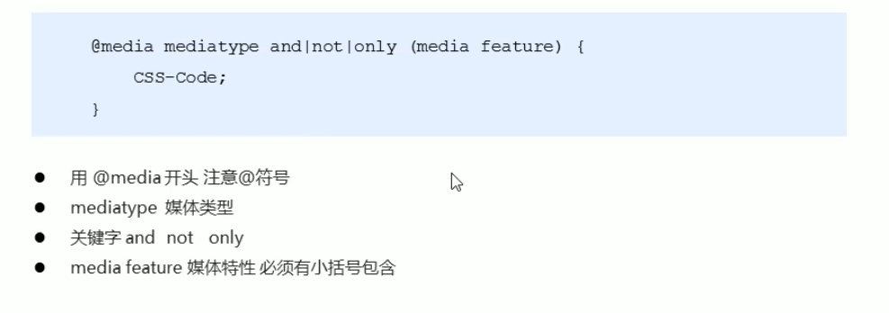
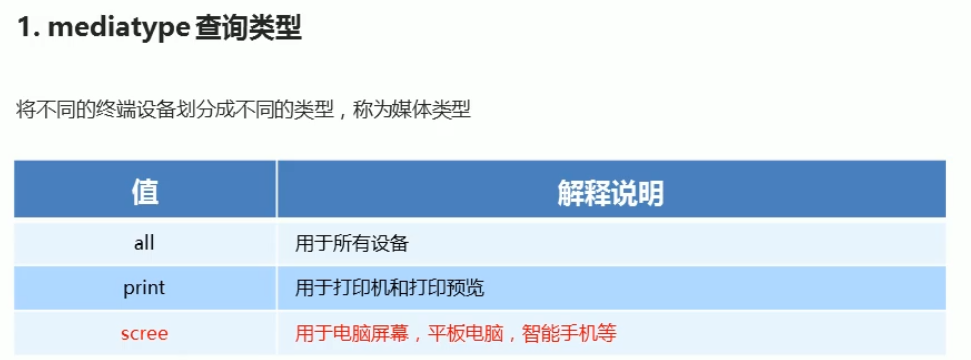
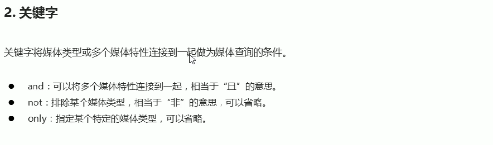
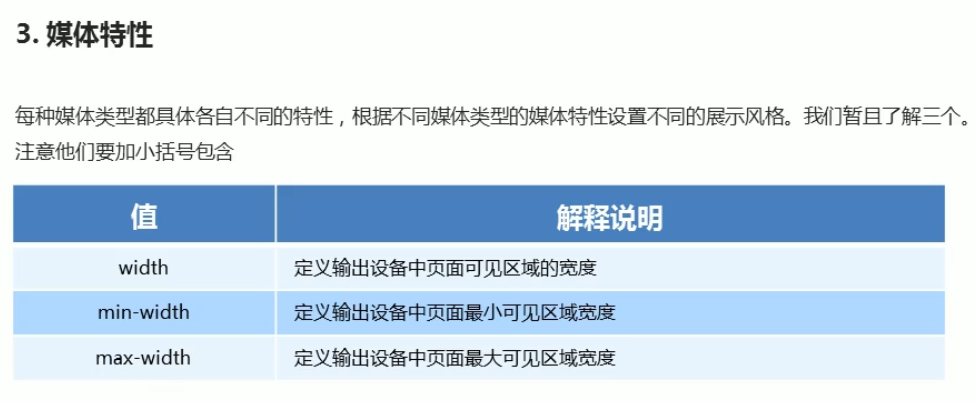

### rem单位

`em`          

1. 用于字体大小：子元素`font-size`使用em时是**父元素**这一属性的n倍，如果父元素没有设置字体大小且无更大的父元素则父元素的字体大小为浏览器默认字体大小,一般为`16px`
2. 用于`width height margin padding border`中的尺寸，为**当前元素**的`font-size` 的n倍。当前元素没有`font-size`属性则为父元素`font-size`的n倍。

`rem`   css3 

1. 在css中为\<html>元素设置`font-size` ，
2. 此页面上应用`rem` 的单位都是相对这一尺寸的n倍，不再相对父元素全部相对于这一`font-size`，字体是这样，其他的如`width height margin`等也是相对于\<html>的字体大小的n倍

通过根据不同的屏幕大小修改html中的`font-size` 就能修改页面中 rem单位元素的大小。


### 媒体查询











案例

<=799时，背景为蓝色；>=800时，背景为黄色；>=1000时，背景为绿黄色

```css
@media screen and (max-width: 799px){
  body {
    background-color: blue;
  }
}
@media screen and (min-width: 800px){
  body {
    background-color: yellow;
  }
}
@media screen and (min-width: 1000px){
  body {
    background-color: greenyellow;
  }
}
```

媒体查询也具有层叠性，当各个媒体查询有冲突时，后定义的会覆盖先定义的。


通过媒体查询根据不同的屏幕尺寸引入不同的CSS文件

```html
<link rel="stylesheet" href="style400.css" media="screen and (min-width: 400px)">
  <link rel="stylesheet" href="style800.css" media="screen and (min-width: 800px)">
```

当屏幕宽度 >= 400px时，引入并应用 style400.css文件；当屏幕宽度 >= 800px时，引入并应用 style800.css文件；
