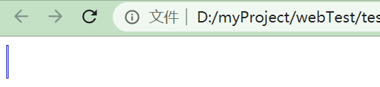

## 过渡css3


为元素从一种样式转变为另一种样式的过程中添加效果。

常和 `:hover`搭配使用。


运动曲线：

```css
linear 匀速 | ease 逐渐慢 | ease-in 加速 | ease-out 减速 | ease-in-out 加速后减速
```


举例1：hover盒子宽度变大时有过渡效果

```css
div {
  width: 200px;
  height: 200px;
  background-color: blue;
  transition: width .5s, height .5s;   //多个属性需要过渡时使用d
}
div:hover {
  width: 400px;
  height: 400px;
}
```

举例2：hover盒子出现阴影时有过渡效果

```css
div {
  width: 200px;
  height: 400px;
  background-color: blue;
  transition: box-shadow .5s;
}
div:hover {
  box-shadow: 0px 0px 10px  black;
}
```


## 动画CSS3


第一步：定义动画

第二步：在元素中使用此动画

```css
@keyframes move{                        /*定义名为move的动画*/
      0% {}
      50% {
        transform: translateX(1000px);
      }
      100% {
        transform: translateX(0);
      }
}
.div {                                        
      width: 100px;
      height: 100px;
      background-color: green;
      animation-name: move;                     /*在元素中使用此动画*/
      animation-duration: 2s;
      animation-iteration-count: infinite;
}
```


1. animation常用属性：


动画完成后此元素会自动回到初始样式（在css中定义的样式，不是动画中0%的样式）！


2. 动画曲线取值：


`steps()`参数为数字，指分几步完成此动画。

案例：

```css
@keyframes move{
      0% {}
      100% {
        width: 200px;
      }
}
.div {
      width: 0;
      height: 30px;
      border: 1px solid blue;
      font-size: 20px;
      overflow: hidden;
      animation: move  4s  steps(10);     /*分10步完成宽度变为200p*/
}

 <div class="div">这个笑容由我来守护</div>
```




3. animation简写：


