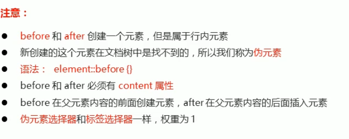

## 属性选择器css3

选择同一种元素中具有指定属性的那些元素

如 `input[value] {}`选择所有 input元素中具有 value属性的 input元素（不论值）


## 伪类选择器

链接伪类选择器

```css
a:link            /* 选择所有未被访问过的链接*/
a:visited         /* 选择所有已被访问过的链接，一旦访问刷新也无法返回原来的状态了*/
a:hover           /* 选择鼠标指针位于其上的链接*/
a:active          /* 选择鼠标按下为弹起的链接*/
```

1. 在使用多个伪类选择器时，必须按照上面顺序定义！否则不生效

2. `:hover`可以单独存在；但`:visited :active`使用时前面必须定义了 `:link`否则不生效

```css
:link{} 
:visited{}

:link{}
:active{}
```


表单伪类选择器

```css
input:focus {}       /* 选择获得焦点的表单元素*/
```


## 结构伪类选择器css3


1. **前三个使用时冒号之前必须有空格！ `ul :first-child {}`**
2. **后三个使用时没有空格！`a:first-of-type {}` **


`nth-child`的值可以是数字，可以是关键字，可以是表达式

1. 数字，第n个子元素 。第一个是1不是0 
2. 关键字， `even偶数 ； odd奇数`。第一个是1不是0 
3. 表达式


如：2n


## 伪元素选择器css3


在指定元素**内部**创建一个行内元素。

```css
el::before {}               //作为el元素的第一个子元素
el::after {}                //作为el元素的最后一个子元素
```



注意：

1. content属性是必须的，不想要创建的元素有文字内容时可以将`content= ''`，但此时行内元素无内容不显示，可以将此行内元素改为块级元素。
2. 这个元素在文档树中找不到，不是真正的HTML元素，在浏览器中


3. 控制此行内元素

```css
.father::before {}              //给.father添加一个行内元素
.father:hover::before {}        //当.father hover时给行内元素设置样式
```

其它元素好像不能给新建的行内元素设置样式。


## 复合选择器

|            |                                  |                        |
| ---------- | -------------------------------- | ---------------------- |
| 后代选择器 | .nav a （空格间隔）              | 所有层级下的指定子元素 |
| 子代选择器 | .nav > a  （大于号间隔）         | 直接子元素             |
| 混合选择器 | .nav , a , .detail  （逗号间隔） | 多个元素共用一种样式   |

