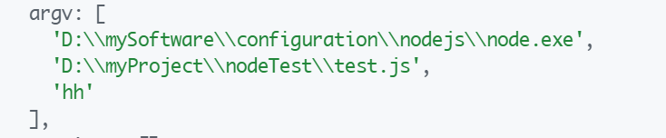
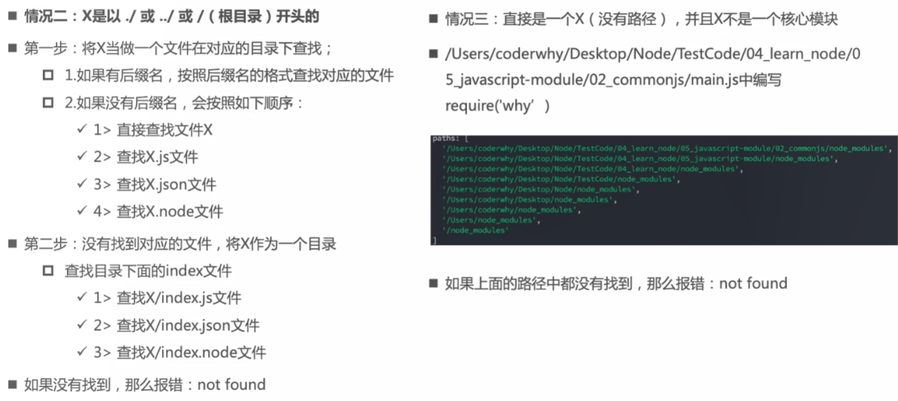
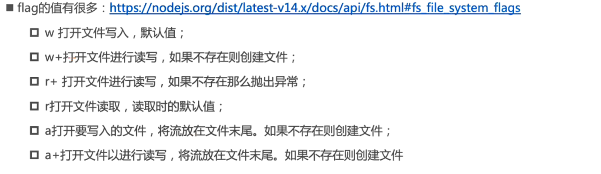
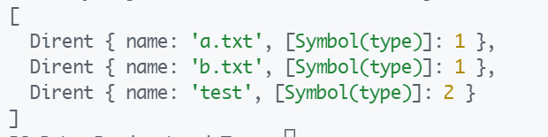

几个概念


Node.js 就是一个可以让 js 运行在服务端的开发平台。

通过npm命令可以在npm服务器下载别人编写的第三方包或命令行程序到本地使用，也可以上传自己编写的包或命令行程序到npm服务器供别人下载。

每个通过npm安装的包（也可以叫做模块）的文件夹目录下都有一个package.json文件，package.json 就是一个管理你通过npm安装到本地的包的文件，里面显示了包的各种信息。


Express是node.js常用的web应用框架，可以通过npm全局下载该模块。


## 一些全局对象


1. node运行 js文件时可以传入参数

```js
node .\test.js hh
```

参数保存在内置对象 `process` （进程）的 `argv`数组属性中，此属性保存着 node和此js文件在本机中的绝对路径以及传进来的参数的字符串。




2. 特殊的全局对象


`__dirname `：所在目录的绝对路径

`__filename `：本文件的绝对路径

（双下划线）


3. 常用全局对象

process（进程）

全局对象：浏览器（window）; Node（global）


## 模块化


在开发时通常将各种功能分开到不同的 JS文件中使项目结构更加清晰。但这样也会带来问题，如因为JS文件都会导入到一个HTML文件中，在执行时定义在一个文件中的全局变量在其它文件中也可以访问到。容易引起变量名冲突即变量的全局污染等问题。

我们可以在每个JS文件中定义一个立即执行函数，将所有的代码写到这个函数中就可以解决变量的全局污染问题。但我们需要使用到其它JS文件的数据时就比较麻烦。


现代 JS文件多以模块化方式编写，这样的 JS文件成为模块。每个模块都有自己的作用域，不会影响到其它模块。可以根据据需要将变量、对象和方法等导出给其它模块使用，也可以导入别的模块的变量、对象和方法等。


在 node中，CommonJS不能导入 ES_modules的导出；但 ES_modules可以导入 CommonJS的导出（相当于 default导出）。


### CommonJS


#### 基本导入导出

导出

```js
// send.js

let name = 'admin';
let age = 20;
function foo() {
  console.log("send");
}

module.exports = {
  name,              
  age,               
  foo,
}
```

导入

```js
//receive.js

const send = require('./send');      //下文可以以send.name的方式访问导入的数据

const {name, age, foo} = require('./send');    //解构后下文可以直接访问name
```


#### 导出原理


CommonJS的导出原理是**值复制**。


每个模块都对应一个 module对象，其有一个 exports属性。导出时给module.exports指向一个新对象。定义属性为要导出的数据，值为要导出的数据的值。

require()返回的就是对应模块的 module.exports指向的对象。

注意：

在导出文件中更改了基本数据类型的值后，不会在导出文件中反应。但更改了引用类型如对象的属性后会在每个导入模块中反应。

多个导入模块访问到的是同一个对象，一个导入模块更改了此对象，也会在其它导入模块中反应。但不会在导出模块中反应。


module.exports导出和 exports导出的区别：

```js
// 还可以这样导出：
exports.name = name;
exports.age = age;
exports.foo = foo;
```

exports导出是 CommonJS规范的标准，CommonJS中并没有module.exports。Node实现 CommonJS并没有完全遵循这个规范。

在 Node中模块的导出实际上只能是 module.exports。但默认情况下在运行 JS文件前就会 `module.exports = exports`，所以在 Node中也可以使用 exports导出，但一旦像上面一样给 module.exports指定了新对象，exports导出就没有意义了。


#### 加载方式

require()导入其它模块时会立即执行一次该模块中的代码，且是同步的，执行完之后才能继续向下本模块中的代码。

```js
console.log("bar");          /** bar.js*/

require("./bar")             /** send.js*/
console.log("send");

require("./send")            /** receive.js*/
console.log("receive");

node receive.js结果： bar send recive
```

如果在一次执行中多次调用了一个模块，其只会执行一次。

```js
/** receive.js*/

require("./send")
require("./bar")            //send.js引入了一次，这里又引入了一次
console.log("receive");

node receive.js结果还是： bar send recive
```


#### require(X)的查找规则





由情况2： 查找 ./bar.js 时可以直接写为 require("./bar")不写后缀名；查找 ./home/index.js 时，可以直接写为 require("./home")

情况3：没有路径又不是核心模块时，会从本 JS文件所在目录下的 node_modules目录中查找，如02_commonjs/node_modules中查找 why，如果没有就去父级目录下的 node_modules目录中查找，如05_javascript-module/node_modules中查找 why。这样一直向上查找下去，直到根目录的node_modules目录。


#### 为什么不在浏览器用CommonJS

回答这个问题之前，我们首先要清楚一个事实，CommonJS的 `require` 语法是同步的，当我们使用`require` 加载一个模块的时候，必须要等这个模块加载完后，才会执行后面的代码。如果知道这个事实，那我们的问题也就很容易回答了。**NodeJS** 是服务端，使用 `require` 语法加载模块，一般是一个文件，只需要从本地硬盘中读取文件，它的速度是比较快的。但是在浏览器端就不一样了，文件一般存放在服务器或者CDN上，如果使用同步的方式加载一个模块还需要由网络来决定快慢，可能时间会很长，这样浏览器很容易进入“假死状态”。所以才有了后面的**AMD**和**CMD**模块化方案，它们都是异步加载的，比较适合在浏览器端使用。


 

### ES_modules


node默认使用的是 CommonJS规范，要想使用 ES_modules规范。第一种方式`package.json`文件配置 `type: module`；第二种方式是将使用 ES_modules的导入导出文件拓展名改为 `.mjs`。


#### 3种导出方式


1. **常用：打包导出**

```js
const name = "admin";
function showName() {
  console.log(name);
}

export {
  name,
  showName,
}
```

注意！这里的并不是导入了一个对象，大括号是语法。在大括号内定义键值对会报错，大括号内放置的是导出的变量和函数的引用列表。


2. 变量和函数的单独导出：

```js
export const name = "admin";
export function showName() {
  console.log(name);
}
```


3. 起别名打包导出：

```js
const name = "admin";
function showName() {
  console.log(name);
}

export {
  name as Sname,
  showName as SshowName,
}

//导入时需要导入别名
```


#### 3种导入方式


1. **常用：**直接导入需要的

```js
import { name, showName } from "./send.js";
```

将需要导入的变量或函数写在大括号内。注意大括号是语法并不是导入了对象。


2. 导入后起别名

```js
import { name as Rname, showName as RshowName } from "./send.js";
```


3. 导入打包到一个对象中

```js
import * as send from "./send.js";

send.showName();
```

作为对象的属性和方法调用。


#### 默认导入导出


一个模块中只能有一个默认导出

```js
/** 导出 */
export default function() {
  console.log(name);
}

/** 导入 */
import showName from "./send.js";
```

导入时不需要写大括号，并可以自定义导入变量或函数的名字。


#### 导出原理


ES_modules在**编译时**会生成一块叫做模块环境记录的内存空间。用于保存导出的数据。

```js
export const name = "admin";
export const student = {...};
```

1. 当导出基本数据类型的变量如 name时

在模块环境记录中定义 `const name = name`，即定义一个常量保存要导出的变量的值。当基本数据类型的值发生改变时，会销毁掉此常量并重新定义一个常量保存新的值，在导入文件中导入的是这个常量。所以在导出文件中改变值时，导入文件中也会响应式的改变；但导入文件中改变值时会报错，因为是 const定义的常量，不能改变值。

2. 当导出引用类型的变量如 student时

在模块环境记录中定义 `const student = student`，即定义一个常量保存引用类型变量的地址。也就是说导出导入文件访问这一变量时访问到的是同一个地址。与导出基本数据类型不同，导出导入文件都可以修改 student对象的属性，也会响应式的反映到每个文件。


#### 加载方式


ES_modules：在编译时确定模块间的依赖关系。

CommonJS：在运行时加载模块，且加载模块是同步的。


例如：

ES_modules中的导入（import ... from “...”）是不能放在逻辑代码中的。即不能条件为真导入，条件为假则不导入。

原因：使用ES_modules的模块间的依赖关系是在编译阶段确定的。但写到逻辑代码中后，导入语句只有在运行阶段才会被调用，会报错

但 CommonJS的导入方式 require函数可以写到逻辑代码中。

原因：CommonJS的 require函数就是在运行时加载模块的，所以自然可以放到逻辑代码中。


那如何解决这一问题呢？

1. 在 webpack环境中：webpack支持多种模块化规范，所以大可以使用 ES_modules规范导出，使用 CommonJS规范导入。
2. 纯 ES_modules环境：使用 ES_modules提供的 import函数

```js
if( flag ) {
  import('./send.js').then(res => {
    console.log(res.name);
    console.log(res.age);
  }).catch(err => {
    
  })
}
```

ES_modules提供的 import函数是异步导入，会在执行到时重新确认依赖关系，并返回一个 Promise对象。如果导入成功，则可以在 then方法中通过 res以对象的属性的方式访问变量和函数；如果导入失败，则调用catch方法。

另：使用 import函数导入的模块在 webpack打包时会单独打包成一个 JS文件，能够减小 App.js的体积，缓解首页白屏的问题。


#### 顶层的 this指向的区别


## 常见的内置模块


### path

path模块用于对路径进行处理，提供了很多好用的方法。


不同的操作系统使用的路径分隔符可能是不一样的，在路径拼接时不能直接拼接，应该使用 path模块的方法，它会使拼接后的路径字符串符合运行时的操作系统的路径分隔符。

`path.resolve()`路径拼接

```js
const path = require("path");           //引入 path模块

const basePath = "/User/account";
const fileName = "config.txt";

const totalPath = path.resolve(basePath, fileName);   //路径拼接方法

console.log(totalPath);            //    D:\User\account\config.txt
```

`path.join()`路径拼接

传什么就拼什么，并将拼接后的字符串中的分隔符转为当前操作系统支持的。

```js
const totalPath = path.join(basePath, fileName);   //路径拼接方法

console.log(totalPath);            //    \User\account\config.txt
```


获取某个文件路径中的目录路径、文件名称和文件后缀名

```js
const path = require("path");

const fileName = "/User/account/config.txt";   

console.log( path.dirname(fileName) );       //   /User/account  目录路径
console.log( path.basename(fileName) );      //   config.txt     文件名称
console.log( path.extname(fileName) );       //   .txt           文件后缀名
```


### fs

fs：文件系统，用于在任何操作系统中操作文件


读取文件相关信息，有三种方法

```js
const fs = require("fs")

const filePath = "./aaa.txt";

//同步操作方式，会阻塞后面的代码
const info = fs.statSync(filePath);
console.log(info);

//异步操作：回调函数方式
fs.stat(filePath, (err, info) => {
  if(err) {
    console.log(err);
    return;
  }
  console.log(info);
})

//异步操作：promise方式
fs.promises.stat(filePath)
  .then(info => {
    console.log(info);
  })
  .catch(err => {
    console.log(err);
    return;
  })
```


文件描述符

每个打开的文件都有一个称为文件描述符的的简单的数字标识符，文件系统通过文件描述符来操作和跟踪文件

```js
const fs = require("fs");

const fileName = "./aaa.txt"

fs.open(fileName, (err, fd) => {
  if(err) {
    console.log(err);
    return;
  }
  console.log(fd);                     //打印文件描述符
  
  fs.fstat(fd, (err, info) => {       //通过文件描述符查看文件相关信息
    //省略错误处理
    console.log(info);
  })
})
```


写入文件

```js
const fs = require("fs");

const fileName = "./aaa.txt";
const content = "hello world"

fs.writeFile(fileName, content, {flag: "a"}, err => {
  if(err) {
    console.log(err);
  }
})
```





读取文件

```js
const fs = require("fs");

const fileName = "./aaa.txt";

fs.readFile(fileName, {encoding: "utf-8"}, (err, data) => {
  //省略错误处理
  console.log(data);
})
```


操作文件夹

```js
const fs = require("fs");
const path = require("path");

/** 创建文件夹 */
const dirname = "./test";       //定义创建文件夹的路径

if(!fs.existsSync(dirname)) {    //如果此路径的文件夹不存在则创建该文件夹
  fs.mkdir(dirname, err => {
    if(err) console.log(err); 
  })
}

/** 读取文件夹中的所有直接子文件，子文件夹名称 */
fs.readdir(dirname, (err, files) => {
  //错误处理省略
  console.log(files);    //files返回子文件名、子文件夹名的字符串数组
})

/** 读取文件夹中所有层级的文件 */
function getFiles(dirname) {
  fs.readdir(dirname, { withFileTypes: true }, (err, files) => {
    //错误处理省略
    files.forEach(file => {              //遍历每个子文件或子文件夹对象
      if(file.isDirectory()) {           //如果是目录
        const newFolder = path.resolve(dirname, file.name);
        getFiles(newFolder);
      } else {                          //如果是文件
        console.log(file.name);
      }
    })
  })
}
getFiles(dirname);

/** 重命名文件或目录*/
fs.rename("./test", "./practice", err => {  
  if(err) console.log(err);             // 将 ./test目录重命名为./practice
})
```


`fs.readdir()`函数中设置  `{ withFileTypes: true }`属性，files会返回子文件或子文件夹对象组成的数组




### events

Node.js 中的核心 API都是基于异步事件驱动的。


```js
const EventEmitter = require("events")

const emitter = new EventEmitter();

emitter.on("click", (argu) => {
  console.log("click1", argu);
})

const listener1 = (argu) => {
  console.log("click2", argu);
}
emitter.on("click", listener1);

setTimeout(() => {
  emitter.emit("click", "hello");        //发送click事件
  emitter.off("click", listener1);       //取消监听 listener1
}, 2000);
// 第一个参数表示发送的事件名称，后面可以写任意个参数表示传给事件监听器的参数
```

