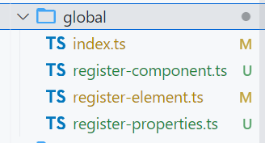
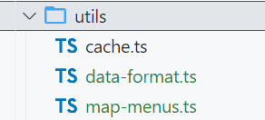

第一部分：项目配置，如何在编写代码前去配置各种配置文件，如何在TS下集成各种第三方库。

第二部分：登录视图

第三部分：主页：侧边栏展示菜单数据、动态路由

第四部分：新的组件封装思路（封装组件+配置文件），用于element-plus和echarts展示数据


# 项目搭建流程


## 一. 项目配置


### 1.1 .editorconfig文件

项目中不同的开发人员可能有不同的编码风格，在同一个项目中显得比较混乱。

编辑器会将项目中.editorconfig文件中的配置应用到本项目中，有助于项目中的开发人员维护一致的编码风格。

```yaml
# http://editorconfig.org

root = true

[*] # 表示所有文件适用
charset = utf-8 # 设置文件字符集为 utf-8
indent_style = space # 缩进风格（tab | space）
indent_size = 2 # 缩进大小
end_of_line = lf # 控制换行类型(lf | cr | crlf)
trim_trailing_whitespace = true # 去除行首的任意空白字符
insert_final_newline = true # 始终在文件末尾插入一个新行

[*.md] # 表示仅 md 文件适用以下规则
max_line_length = off
trim_trailing_whitespace = false
```


VSCode需要安装一个插件：EditorConfig for VS Code


### 1.2 prettier代码格式化

Prettier 是一款强大的代码格式化工具，基本上前端能用到的文件格式它都可以搞定，是当下最流行的代码格式化工具。


1.安装prettier

```shell
npm install prettier -D
```

2.配置.prettierrc文件：

* useTabs：使用tab缩进还是空格缩进，选择false即空格缩进；
* tabWidth：tab是空格的情况下，是几个空格，选择2个；
* printWidth：当行字符的长度，推荐80，也有人喜欢100或者120；
* singleQuote：使用单引号还是双引号，选择true，使用单引号；
* trailingComma：在多行输入的尾逗号是否添加，设置为 `none`；
* semi：语句末尾是否要加分号，默认值true，选择false表示不加；

```json
{
  "useTabs": false,
  "tabWidth": 2,
  "printWidth": 80,
  "singleQuote": true,
  "trailingComma": "none",
  "semi": false
}
```


3.创建.prettierignore忽略文件

```
/dist/*
.local
.output.js
/node_modules/**

**/*.svg
**/*.sh

/public/*
```


4.VSCode需要安装prettier的插件


5.测试prettier是否生效

* 测试一：在编辑器中保存代码，格式化本文件；
* 测试二：配置一次性修改的命令，格式化所有文件；

在package.json中配置一个scripts：

```json
"prettier": "prettier --write ."
```

在终端中运行

```shell
npm run prettier
```


### 1.3 使用ESLint检测

1.在前面创建项目的时候，我们就选择了ESLint，所以Vue会默认帮助我们配置需要的ESLint环境。

2.VSCode需要安装ESLint插件：


3.解决eslint和prettier冲突的问题：


prettier可以按照prettier的规范进行格式化，eslint按照eslint的规范进行代码检测，那就不可避免地会有规范冲突问题。

安装插件：（vue在创建项目时，如果选择prettier，那么这两个插件会自动安装）

```shell
npm i eslint-plugin-prettier eslint-config-prettier -D
```

添加prettier插件：（在.eslintrc.js中）

```json
  extends: [
    "plugin:vue/vue3-essential",
    "eslint:recommended",
    "@vue/typescript/recommended",
    "@vue/prettier",
    "@vue/prettier/@typescript-eslint",
    "plugin:prettier/recommended"              //添加
  ],
```


### 1.4 git Husky和eslint

虽然我们已经要求项目使用eslint了，但是不能保证组员提交代码之前都将eslint中的问题解决掉了才提交到 GITHUB：

* 也就是我们希望保证代码仓库中的代码都是符合eslint规范的；

* 那么我们需要在组员执行 `git commit ` 命令的时候对其进行校验，如果不符合eslint规范，那么自动通过规范进行修复；

那么如何做到这一点呢？可以通过Husky工具：

* husky是一个git hook工具，可以帮助我们触发git提交的各个阶段：pre-commit、commit-msg、pre-push

如何使用husky呢？

这里我们可以使用自动配置命令：

```shell
npx husky-init ; npm install    //;表示执行完前一个操作再执行后一个操作
```

这里会做三件事：

1.安装husky相关的依赖：


2.在项目目录下创建 `.husky` 文件夹：


3.在package.json中添加一个脚本：


在.husky/pre-commit文件中将 npm test修改为 npm run lint。这样在进行git commit时，就会先自动执行lint脚本，对项目中的文件进行eslint检测不和规范则会报错不会commit。


### 1.5 git commit规范


#### 1.5.1. 代码提交风格

通常我们的git commit会按照统一的风格来提交，这样可以快速定位每次提交的内容，方便之后对版本进行控制。


但是如果每次手动来编写这些是比较麻烦的事情，我们可以使用一个工具：Commitizen

* Commitizen 是一个帮助我们编写规范 commit message 的工具；

1.安装Commitizen

```shell
npm install commitizen -D
```

2.安装cz-conventional-changelog，并且初始化cz-conventional-changelog：

```shell
npx commitizen init cz-conventional-changelog --save-dev --save-exact
```

这个命令会帮助我们安装cz-conventional-changelog：


并且在package.json中自动进行配置：


**以后我们提交代码需要使用 `npx cz`：**

注意！！ npx cz需要在git bash中进行，在powerShell中会报错

* 第一步是选择type，本次更新的类型

| Type     | 作用                                                         |
| -------- | ------------------------------------------------------------ |
| feat     | 新增特性 (feature)                                           |
| fix      | 修复 Bug(bug fix)                                            |
| docs     | 修改文档 (documentation)                                     |
| style    | 代码格式修改(white-space, formatting, missing semi colons, etc) |
| refactor | 代码重构(refactor)                                           |
| perf     | 改善性能(A code change that improves performance)            |
| test     | 测试(when adding missing tests)                              |
| build    | 变更项目构建或外部依赖（例如 scopes: webpack、gulp、npm 等） |
| ci       | 更改持续集成软件的配置文件和 package 中的 scripts 命令，例如 scopes: Travis, Circle 等 |
| chore    | 变更构建流程或辅助工具(比如更改测试环境)                     |
| revert   | 代码回退                                                     |

* 第二步选择本次修改的范围（作用域）


* 第三步选择提交的信息


* 第四步提交详细的描述信息


* 第五步是否是一次重大的更改


* 第六步是否影响某个open issue


我们也可以在scripts中构建一个命令来执行 cz：


#### 1.5.2. 代码提交验证

如果我们按照 `npx cz` 来规范了提交风格，但是依然有同事通过 `git commit` 按照不规范的格式提交应该怎么办呢？

* 我们可以通过commitlint来限制提交；

安装 @commitlint/config-conventional 和 @commitlint/cli

```shell
npm i @commitlint/config-conventional @commitlint/cli -D
```

在根目录创建commitlint.config.js文件，配置commitlint

```js
module.exports = {  extends: ['@commitlint/config-conventional']}
```

使用husky生成commit-msg文件，验证提交信息：

```shell
npx husky add .husky/commit-msg "npx --no-install commitlint --edit $1"
```


### 1.6 git工作流


前面配置了在 git commit 之前进行 eslint 检测，又配置了npx cz 取代 git commit 和 禁用 git commit。

项目中完整的 git 流程为 ： git add .  |   npx cz    |  git push


注意！！ npx cz需要在git bash中进行，在powerShell中报错，所以全部流程都在git bash中完成吧

另：gitbash和powershell路径方式的不同 ：cd /d/myProject     cd D:/myProject


### 1.7 vue.config.js

在vue-CLI4中 webpack的配置文件都是隐藏的，我们可以通过创建 vue.config.js来对 webpack进行自定义配置，会合并。


vue.config.js有三种配置方式：

* 方式一：直接通过CLI提供给我们的选项来配置：
  * 比如publicPath：配置应用程序部署的子目录（默认是 `/`，相当于部署在 `https://www.my-app.com/`）；
  * 比如outputDir：修改打包后的文件夹名称；
* 方式二：通过configureWebpack修改webpack的配置：
  * 可以是一个对象，直接会被合并到项目中webpack的配置；
  * 可以是一个函数，会接收一个config，可以通过config来修改配置；
* 方式三：通过chainWebpack修改webpack的配置：
  * 是一个函数，会接收一个基于  [webpack-chain](https://github.com/mozilla-neutrino/webpack-chain) 的config对象，可以对配置进行修改；

```js
/** vue.config.js*/

const path = require('path')
module.exports = {  
  outputDir: './build',         //修改打包后的文件的名称 dist为build
  configureWebpack: {          //方式二（1）对象的方式配置webpack，以起别名为例
    resolve: {  
      alias: {  
        views: '@/views'  
      }  
    }  
  }  
  configureWebpack: (config) => {            //方式二（2）函数的方式配置webpack
    config.resolve.alias = {  
      '@': path.resolve(__dirname, 'src'), 
      views: '@/views'  
    }  
  },    
  chainWebpack: (config) => {                    //方式三，以起别名为例
    config.resolve.alias
      .set('@', path.resolve(__dirname, 'src'))
      .set('views', '@/views')  
  }
}
```


**注意**：在使用时import导入可以直接使用别名；而在HTML中的资源导入如src等需要在别名前面加一个`~`，在CSS中也是。

```javascript
import TabBar from 'components/tabbar/TabBar';
```

```html

```


### 1.8 配置assets目录


```
assets
   ├── css             # css目录
        ├── index.less                 # 统一导出文件
        └── ...                        # 自定义css文件
   └── img              # img目录
        └── ...                        # 图片
```


引入基础css配置

- 从github上下载 normalize.css，放到 assets/css中，并在 main.js中引入。
- npm install normalize.css 并在main.js中引入

```typescript
import 'normalize.css'
```


## 二. 第三方库集成


### 2.1 vue-router集成

安装vue-router的最新版本：

```shell
npm install vue-router@next
```

创建router对象：**在TS中，定义routes对象需要声明类型**

```ts
// router/index.ts

import { createRouter, createWebHashHistory } from 'vue-router'
import { RouteRecordRaw } from 'vue-router'
const routes: RouteRecordRaw[] = [  
  { path: '/', redirect: '/main' },  
  { path: '/login', component: () => import('../views/login/login.vue') },
  {
    path: '/:pathMatch(.*)*',
    name: 'notFound',
    component: () => import('@/views/not-found/not-found.vue')
  }
]
const router = createRouter( { routes, history: createWebHashHistory()} )
export default router
```

安装router：main.ts

```ts
import router from './router'
createApp(App).use(router).mount('#app')
```

在App.vue中配置：

```html
<template> 
  <div id="app">  
    <router-view></router-view> 
  </div>
</template>
```


### 2.2 vuex集成

安装vuex：

```shell
npm install vuex@next
```

store/index.ts：创建store对象：**在ts中需要给每个模块的state声明类型**

```typescript
import { createStore } from 'vuex'
import { RootStateType } from './types'

//根模块
const store = createStore<RootStateType>({
  //RootStateType：在ts中需要给模块的state声明类型
  state() {
    return {}
  }
})

export default store
```

store/types.ts ：定义vuex中各个模块的state的类型的文件

```typescript
// 给根模块中state声明类型
interface RootStateType {
}

export {
  RootStateType
}
```


安装store：

```ts
import store from './store'
createApp(App).use(router).use(store).mount('#app')
```


### 2.3 element-plus集成

Element Plus，一套基于 Vue 3.0 的桌面端组件库：

安装element-plus

```shell
npm install element-plus
```


#### 2.3.1. 全局引入

一种引入element-plus的方式是全局引入，代表的含义是所有的组件和插件都会被自动注册：

```typescript
/** src/index.ts*/
import ElementPlus from 'element-plus'               //引入组件
import 'element-plus/lib/theme-chalk/index.css'      //引入样式
import 'element-plus/lib/theme-chalk/base.css'
createApp(App).use(router).use(store).use(ElementPlus).mount('#app')
//作为插件安装
```

从官网中复制样式，在组件模板中直接使用。


#### 2.3.2. 局部引入


第一种：用到某个组件时对某个组件进行引入注册，以按钮组件为例

```vue
<template>  
  <div id="app">
    <el-button type="primary">主要按钮</el-button>    <!--3. 官网中复制使用-->
    <el-button type="success">成功按钮</el-button>
  </div>
</template>
<script lang="ts">
  import { defineComponent } from 'vue'
  import { ElButton } from 'element-plus'          //1. 导入按钮组件
  export default defineComponent({
    name: 'App',
    components: {   ElButton  }                  //2. 注册按钮组件
  })
</script>
```

但是我们会发现是没有对应的样式的，引入样式有两种方式：

* 全局引用样式（按照上面全局引入方式在index.ts中引入element-plus/.../index.css）
* 局部引用样式（通过babel的插件）；

1.安装babel的插件：

```shell
npm install babel-plugin-import -D
```

2.配置babel.config.js

```js
module.exports = {
  plugins: [
    [
      'import',
      {
        libraryName: 'element-plus',
        customStyleName: (name) => {
          return `element-plus/lib/theme-chalk/${name}.css`
        }
      }
    ]
  ],
  presets: ['@vue/cli-plugin-babel/preset']
}
```

这样在我们在引入需要的element-plus组件时，就会自动引入对应的样式文件。


第二种：某个element-plus组件在多个组件中都会被使用到

* 需要在多个组件导入并且在components中进行注册，所以我们可以将它们注册为全局组件；
* 在main.ts中定义代码量有点多影响阅读，把它抽取到另一个地方

```ts
// global/register-element.ts

import { App } from 'vue'
import 'element-plus/lib/theme-chalk/base.css'
import {ElButton,  ElTable} from 'element-plus' //获取需要的组件

const components = [ElButton,  ElTable]  //添加到对象中

export function registerElement(app: App) {
  components.forEach((cpn) => {
    app.component(cpn.name, cpn)   //遍历出数组的每一项进行全局注册
  })
}
```

```typescript
// global/index.ts  不直接在mian.ts中调用，通过global目录总的导出文件

import { App } from 'vue'
import {registerElement} from './register-element'  //引入registerElement函数

export function register(app: App) {
  registerElement(app)
  //还会有其它的全局配置函数
}
```

```typescript
// main.ts

import { register } from '@/global'

const app = createApp(App)
register(app)                     //只要调用总的导出函数即可
```


### 2.4 axios集成

安装axios：

```shell
npm install axios
```


### 2.5 echarts集成


```
npm install echarts
```


canvas：擅长渲染大量、复杂的数据

svg：性能较高，适合大部分场景


# 项目经验


## 网络请求


network目录：用于封装项目中所有网络请求的目录。

将第三方库axios封装到该目录中，同时每个视图在network中都对应着一个js文件，里面定义该视图中所有网络请求的方法。


1. 将数据保存到组件中

视图调用network中封装的函数发送网络请求 -->   --> 将数据返回到视图 --> 视图接收并通过props传递给子组件


2. 将数据保存到vuex

视图分发网络请求的action -->  action调用network中封装的函数 --> action接收数据，并保存到state --> 子组件通过vuex拿去数据


## 封装思想


说起封装，就是一个文件中代码太多，对其中相对独立的部分抽取出去。


抽取js代码一般都是封装到一个函数中，在原文件中调用即可。


**第一种类型：定义一个总的导出文件**



global：用于全局配置的目录。

全局组件、全局element-plus组件、全局属性，都需要通过app对象去配置，但如果将这些代码都定义到main.ts中，main.ts代码量会很大阅读性也会很差。

所以封装成三个函数即可，又因为每个函数涉及的代码也不少，所以每个函数单独定义一个js文件。

又由于三个方法都要在同一个文件中调用，就要在main.ts中引入、调用三次。可以定义index.ts作为总的导出文件，定义一个函数分别调用这三个函数。这样在main.ts中只需要引入一次、调用一次即可。


**第二种类型：每个js文件都定义着一种类型的函数**




utils目录：用于封装工具函数的目录

与global目录不同的是，这些js文件中的函数调用的位置不同，所需要的参数也不同，所以不能通过总的导出文件导出。


## 登录视图


1. 结构


登录逻辑：登录按钮事件通过ref调用表单子组件的方法进行登录。

1. 验证表单数据是否符合规则
2. 是否记住密码，是则使用 localCache保存
3. 分发action发送登录请求，返回数据
4. 保存token，添加到请求拦截器中
5. 请求并保存用户信息
6. 请求并保存菜单信息
7. 跳转到首页

在router中设置导航守卫，只要目标路径不是/login,都做判断是否有token(即是否登录)没有则跳转到/login（避免修改url进入其它页面）


TS下使用ref获取子组件，需要指定子组件类型。

在 utils 中封装用于操作缓存数据（localCache）的类和对象。

vuex中每个模块都要声明类型，代表着模块中state的类型

登录请求的返回数据中会携带token，项目中除了登录请求外所有的请求都需要携带token以获得请求权限，所以将token保存（localCache）起来添加到axios的请求拦截器中，这样每次请求时都会携带token了

vuex中的数据是保存在内存中的，刷新页面后会重新加载项目，重置vuex中的所有数据，但不会重置localCache中的。所以将token、用户数据、用户菜单等请求到后除了保存到vuex中外，再保存一份到localCache中。刷新页面后由localCache中的数据重新给vuex中的数据赋值。具体实现：再login模块定义给vuex重新赋值的action，在main.ts中分发。


## 主页


# TIPS


1. 在css中使用文件路径别名的时候前面需要加~，import导入时不需要

```css
.login {
  background: url('~@/assets/img/login-bg.svg');
}
```

