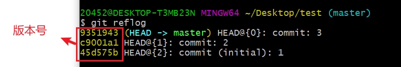
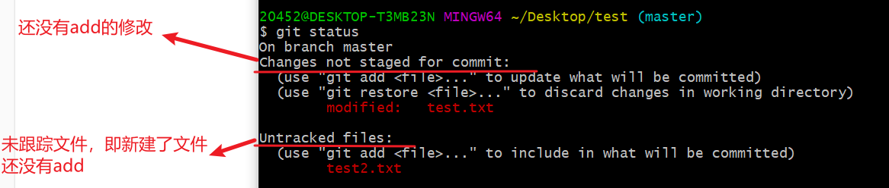
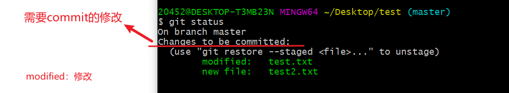
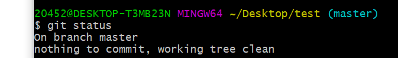

## 配置git

下载完成之后在电脑上的配置

1. 环境变量一般会自动配置。

2. 在命令行中：

```js
git config --global user.name                                   
#此用户名不需要跟GitHub账号保持一致
git config --global user.email                                   
#此邮箱不需要跟GitHub账号保持一致
git config --global push.default matching
git config --global core.quotepath false
git config --global core.editor "vim"
```


## 配置git的SSH

将本地git程序连接到你的Github账户


1. 进入 [https://github.com/settings/keys](https://link.zhihu.com/?target=https%3A//github.com/settings/keys)

2. 如果页面里已经有一些 key，就点「delete」按钮把这些 key 全删掉。如果没有，就往下看

3. 点击 New SSH key，你需要输入 Title 和 Key，但是你现在没有 key，往下看

4. 打开 Git Bash

5. 运行 `ssh-keygen -t rsa -b 4096 -C "你的邮箱"`，注意填写你的邮箱！

6. 按回车三次

7. 运行 `cat ~/.ssh/id_rsa.pub`，得到一串东西，完整的复制这串东西

8. 回到上面第 3 步的页面，在 Title 输入「我的第一个 key」

9. 在 Key 里粘贴刚刚你你复制的那串东西

10. 点击 Add SSH key

11. 回到 Git Bash

12. 运行 `ssh -T git@github.com`

13. 输入 yes 回车……问你话你就答，别傻在那

    1. 然后如果你看到 `Permission denied (publickey).` 就说明你失败了，请回到第 1 步重来，是的，回到第 1 步重来；如果你看到 `Hi FrankFang! You've successfully authenticated, but GitHub does not provide shell access.` 就说明你成功了！


- 一台电脑只需要一个 SSH key
- 一个 SSH key 可以访问你的所有仓库，即使你有 1000000 个仓库，都没问题
- 如果你新买了电脑，就在新电脑上重新生成一个 SSH key，把这个 key 也上传到 GitHub，它可以和之前的 key 共存在 GitHub 上
- 如果你把 key 从电脑上删除了，重新生成一个 key 即可，替换之前的 key


## 在本地创建仓库


在项目目录中打开 `git bash`

```
git init            //初始化仓库，项目目录中生成 .git文件
```


- 使用vue-cli4会在项目中自动生成 `.git` 文件


## 将本地仓库上传到github


1. 在github中创建一个仓库
2. 在新建的仓库首页找到  `…or push an existing repository from the command line` 
3. 本地项目终端依次输入其命令


注意！本地项目目录上传到github之前中必须已经add、commit了一些东西，否则可能会报错。

（如不能刚git init之后就提交到github）


命令解析

```
git remote add origin git@github.com:ananasTete/cms-coderwhy.git
git branch -M main
git push -u origin main
```

？？


## 克隆远程仓库到本地


进入指定github仓库 ->  clone -> 复制SSH地址  -> 打开终端  ->  git  clone  地址


将本地项目上传到github是不会把 `node_modules` 目录传上去的，所以下载到本地的也没有此目录，需要到项目目录终端执行

```
npm install 
```

会在项目中创建`node_modules` 目录，并将所有需要的包下载


## 基础操作


### git init 


初始化本地项目，在本地项目目录中打开 `git bash`

```
git init             //初始化仓库，创建.git目录
```


### git add


```
git add README.md    //将文件添加到暂存区

git add .            //将所有修改添加到暂存区
```


### git commit


```
git commit -m "提交信息"        //将暂存区内容添加到仓库的当前分支(默认为master)
```


### git push


```
git push             //将仓库内容推送到远程仓库(github)
```


### git clone


进入指定github仓库 ->  clone -> 复制SSH地址  -> 打开终端  ->  git  clone  地址


将本地项目上传到github是不会把 `node_modules` 目录传上去的，所以下载到本地的也没有此目录，需要到项目目录终端执行

```
npm install 
```

会在项目中创建`node_modules` 目录，并将所有需要的包下载


### git reset


版本回退

```
git reset --hard HEAD^      //回退到上一个版本，上上个版本为^^，以此类推
```


```
git reflog            //commit一次就有一个版本，查看所有的版本号,从新到旧向下排列
```



```
git reset --hard 45d575b             //回退到指定版本
```


### git checkout


```
git checkout [fileName]      // 取消添加到暂存区的某个文件
```


### git pull


将github项目合并到本地


## 拓展操作


### git status


查看状态，显示有变更的文件。

```
git status                  //查看所有文件状态
git status [fileName]       //查看指定文件状态
```




git add .之后



git commit之后




### git log


```
git log            //查看commit历史,从新到旧向下排列
```


## 分支


同一个项目中不同的组负责开发不同的模块，每个组将代码提交到一个分支最后合并所有的分支。

```
git branch            //查看所有分支

git branch -r         //查看所有远程分支

git checkout [branchName]  //切换分支

git branch [branchName]  //新建分支，依然停留在当前分支

git checkout -b [branchName]    //新建分支并切换到该分支

git branch -d [branchName]  //删除分支

git merge [branchName]      //合并指定分支到当前分支

git push orgin --delete [branchName]    //删除远程分支
git branch -dr [remote/branch]
```


本地创建的分支如何反映到github？
