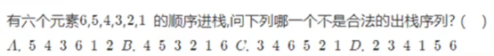

数据结构


计算机中存储、组织数据的方式


## 线性结构：数组、栈、队列


栈和队列是受限的线性结构。

数组可以在任意位置插入和删除元素。


### 栈——后进先出（LIFO）




首先要明白题目中的6个元素不是一次性的全部进栈，负责出栈顺序就只有123456了。

第一个是4出栈，所以栈中应该已经压入了6、5、4。4出栈没问题，接着5出栈没问题，3要出栈它还没进栈所以先进栈再直接出栈，2，1同理，所以B没问题。

第一个是3出栈，所以栈中应该已经压入了6、5、4、3。3出栈没问题，接着4出栈没问题，而6出栈就不行因为5还没出栈，所以C错误。


实现栈：

```js
function Stack() {
   this.items = [];

   //入栈
   Stack.prototype.push = function(element) {
     this.items.push(element);
   }
   //出栈
   Stack.prototype.pop = function() {
     return this.items.pop();
   }
   //查看最后一个元素
   Stack.prototype.peek = function() {
     return this.items[this.items.length - 1];
   }
   //判断栈是否为空
   Stack.prototype.isEmpty = function() {
     return this.items.length == 0;
   }
   //获取栈的长度
   Stack.prototype.size = function() {
     return this.items.length;
   }
   //toString
   Stack.prototype.toString = function() {
     return this.items.toString();
   }
            
}
let test = new Stack();
```

